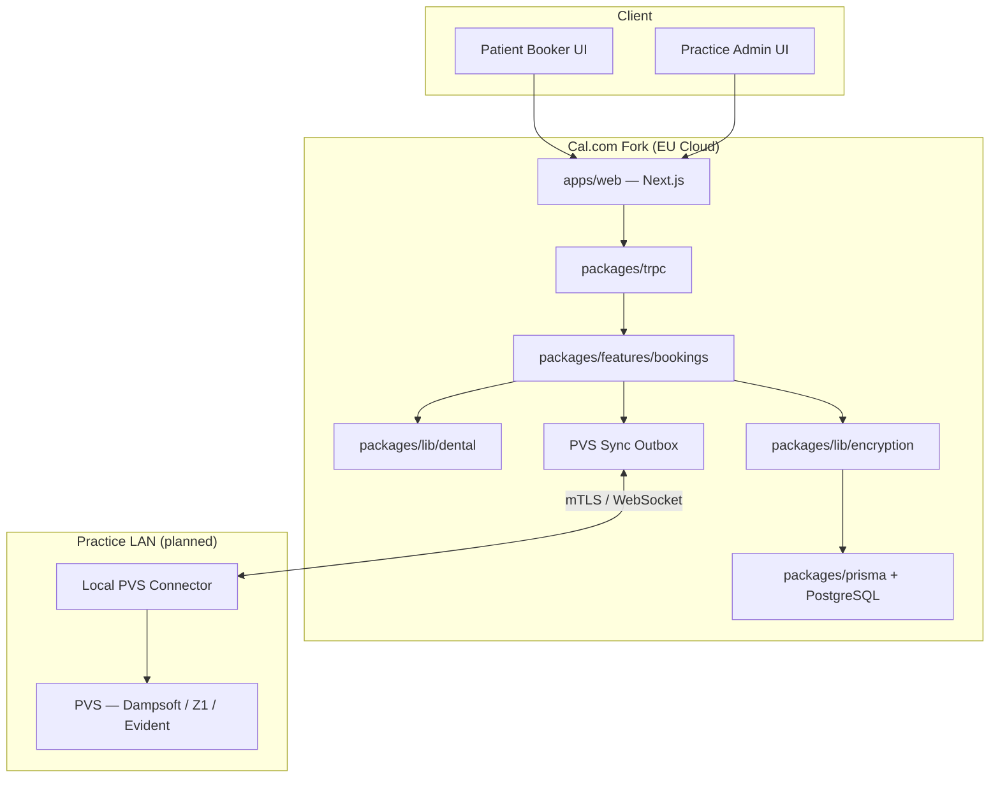
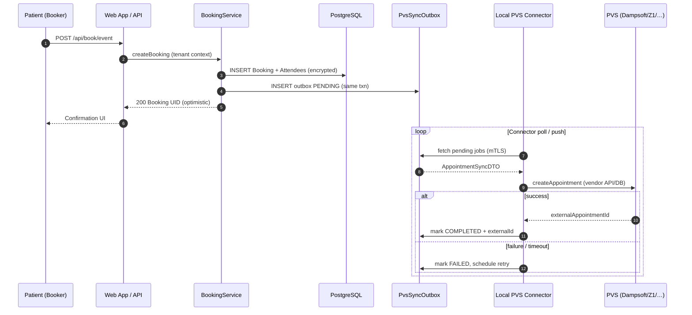
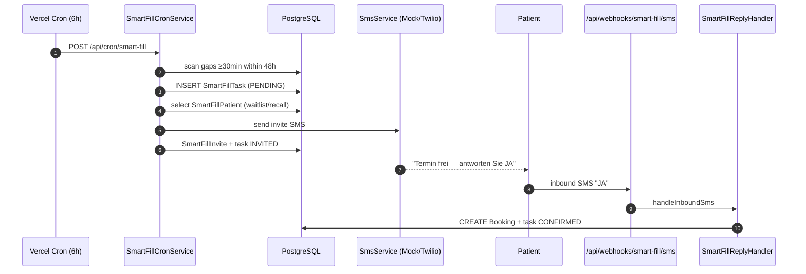

# Architecture — Dental Cal.com Fork (PraxisTermin)

> **Audience:** Engineers, acquirers, and auditors performing technical due diligence.  
> **Companion docs:** [COMPLIANCE.md](./COMPLIANCE.md) (DSGVO/security register), [CHANGELOG.md](./CHANGELOG.md) (release history).

---

## 1. System Context

### 1.1 Purpose

B2B SaaS for German dental practices: online appointment booking with **tenant-isolated field encryption**, **treatment resource scheduling** (chair/room/x-ray), and a planned **PVS integration layer** for bidirectional sync with on-premise practice management systems (Dampsoft, Z1, Evident, …).

### 1.2 High-Level Diagram



### 1.3 Repository Layout (Turborepo)

| Path | Responsibility |
|---|---|
| `apps/web` | Next.js app, booker UI, admin settings, marketing landing |
| `packages/features/bookings` | Booking orchestration (`RegularBookingService`, `createBooking`) |
| `packages/trpc` | API layer, routers, middleware |
| `packages/lib/dental` | Compliance flags, tenant context, treatment resources, booking fields |
| `packages/lib/encryption` | Envelope encryption, KMS abstraction, Prisma field registry |
| `packages/prisma` | Schema, migrations, field-encryption extension |
| `packages/pvs-integration` | PVS adapter interface, DTOs, outbox types, connector protocol |

---

## 2. Design Decisions (ADR Index)

Each significant decision gets a short ADR entry here. Expand in `docs/adr/NNN-title.md` when complexity grows.

| ID | Decision | Rationale | Status |
|---|---|---|---|
| ADR-001 | Envelope encryption per practice (`teamId`), not zero-knowledge | Server must send email/calendar; blind indexes enable search | Accepted |
| ADR-002 | Prisma `$extends` for encrypt/decrypt on read/write | Minimal intrusion vs. forking every repository | Accepted |
| ADR-003 | Explicit decrypt pass for Kysely booking list | Kysely bypasses Prisma extension | Accepted — debt |
| ADR-004 | `KeyManagementService` interface (local-envelope, aws-kms) | Avoid AWS lock-in at API level; swap provider via env | Partial — Vault not implemented |
| ADR-005 | Local PVS Connector for on-prem PVS | Cloud cannot reach practice DB; outbound-only mTLS from connector | Proposed |
| ADR-006 | DB outbox for PVS sync retries | Simpler ops than BullMQ for MVP; same DB transaction as booking | Proposed |
| ADR-007 | Optimistic slot hold in cloud, async PVS confirm | Minimize booking latency; reconcile on connector ack | Proposed |

---

## 3. Domain Model (Dental Extensions)

| Cal.com concept | Dental mapping |
|---|---|
| User / Host | Zahnarzt (dentist) |
| Booker | Patient |
| EventType | Behandlungsart (treatment type) |
| TreatmentResource | Chair / room / x-ray (parallel to host) |
| Team | Praxis (practice tenant) |
| `PracticeEncryptionKey` | Per-practice DEK wrapped by KMS |

---

## 4. Security & Compliance Architecture

> **Detail register:** [COMPLIANCE.md](./COMPLIANCE.md)

### 4.1 Encryption Flow

1. Request enters with `teamId` (middleware or write payload).
2. `runWithDentalPracticeContext()` sets AsyncLocalStorage tenant context.
3. `PracticeKeyResolver` loads/wraps DEK via `KeyManagementService`.
4. Prisma extension encrypts on write, decrypts on read for `Booking`, `Attendee`, `BookingInternalNote`, `VideoCallGuest`.

### 4.2 Two Key Systems (intentional separation)

| Key | Scope |
|---|---|
| `CALENDSO_ENCRYPTION_KEY` | OAuth tokens, 2FA, app credentials (upstream Cal.com) |
| `DENTAL_KMS_MASTER_KEY` / AWS KMS | Patient PII / booking responses |

**Buyer note:** Unified secrets rotation playbook should be documented in COMPLIANCE.md before exit.

### 4.3 Feature Flags

| Function | Env gate |
|---|---|
| Field encryption | `DENTAL_ENCRYPTION_ENABLED` |
| Client compliance UI | `NEXT_PUBLIC_DENTAL_COMPLIANCE_MODE` |
| Tracking/analytics off | `DENTAL_DISABLE_*` or compliance mode |

**Known coupling:** `isDentalComplianceMode()` currently equals `isDentalEncryptionEnabled()` — product/compliance cannot be toggled independently.

---

## 5. Integration Boundaries

### 5.1 Implemented

- **Booking create (public API):** `apps/web/pages/api/book/event.ts` — tenant context wrapper.
- **Booking service:** `RegularBookingService` — health-data guard, tenant wrapper on create/update paths.
- **Slots:** `getSchedule.handler` — treatment resource schedule + busy intervals.
- **Treatment resources:** tRPC `treatmentResources` router + admin UI.

### 5.2 Incomplete / High-Risk Gaps

| Gap | Impact | Target abstraction |
|---|---|---|
| `dentalAuthedProcedure` on only 3 booking routes | Encrypt/decrypt context missing on most mutations | Route registry + required middleware |
| Kysely booking list manual decrypt | New queries may leak ciphertext | Repository interface; ban raw Kysely for PII |
| Stub `PermissionCheckService` in multiple handlers | RBAC always returns `true` | Inject real PBAC from `@calcom/features/pbac` |
| Analytics noop only in Turbopack alias | Production Webpack build may still bundle PostHog/Dub | Webpack + Turbopack aliases; runtime guard |
| No PVS layer | Marketing promises migration; no code | `packages/pvs-integration` (see §6) |

---

## 6. PVS Integration (Planned)

### 6.1 Adapter Pattern

```typescript
// packages/pvs-integration/src/adapters/pvs-adapter.interface.ts (planned)
interface PVSAdapter {
  getFreeSlots(query: FreeSlotsQuery): Promise<FreeSlot[]>;
  createAppointment(dto: AppointmentSyncDTO): Promise<PvsAppointmentRef>;
  updateAppointment(ref: PvsAppointmentRef, dto: AppointmentSyncDTO): Promise<void>;
  cancelAppointment(ref: PvsAppointmentRef, reason?: string): Promise<void>;
  healthCheck(): Promise<PvsHealthStatus>;
}
```

Implementations: `DampsoftAdapter`, `Z1Adapter`, `EvidentAdapter` — each behind the same interface; selected by `PVS_PROVIDER` per team.

### 6.2 Local Connector

- Small Node/Docker service in the practice LAN.
- **Outbound-only** connections to cloud (no inbound DB port exposure).
- mTLS client cert per practice; short-lived JWT for command channel.
- Connector hosts vendor-specific DB/API drivers; cloud speaks only HTTP/gRPC to connector.

### 6.3 Latency Strategy

1. **Cloud:** optimistic booking + slot lock (existing Cal.com reservation flow).
2. **Async:** enqueue `PvsSyncOutbox` row in same DB transaction as booking (create/cancel/reschedule).
3. **Connector:** `@calcom/pvs-connector` polls `/api/pvs/outbox/poll`; writes to PVS via adapter; acks result.
4. **Reconciliation:** on failure, retry with exponential backoff; alert practice admin after N attempts.

See sequence diagram in §8.

---

## 7. Critical Path Tests

> **Policy:** If critical path tests fail, **do not deploy**.

### 7.1 Scope (MVP)

| Layer | Test file (existing / planned) | Asserts |
|---|---|---|
| Encryption round-trip | `packages/lib/dental/booking-encryption.integration.test.ts` | Write payload → `enc:v1` → decrypt |
| Fail-closed encrypt | same | No tenant context → throw |
| Booking list decrypt | `get.handler.test.ts` | Kysely rows decrypted after fetch |
| Slot + resource | `getSchedule.handler.test.ts` | Resource schedule filters slots |
| **PVS outbox enqueue** | `packages/lib/dental/pvs/enqueue-pvs-sync.test.ts`, `enqueue-booking-pvs-sync.test.ts` | Smart-Fill confirm + booker create → outbox `PENDING` |
| **PVS connector poll/ack** | `packages/lib/dental/pvs/pvs-outbox.service.test.ts` | Claim jobs, complete/fail with retry |
| **PVS adapter contract** | `packages/pvs-integration/src/adapters/mock-pvs.adapter.test.ts` | Each adapter passes shared test suite |
| E2E booking | `playwright` smoke (planned) | Booker → confirmation without PVS mock failure |

### 7.2 CI Gate (recommended)

```yaml
# .github/workflows/critical-path.yml (proposed)
- vitest run packages/lib/dental packages/lib/encryption packages/pvs-integration
- vitest run packages/trpc/.../bookings/get.handler.test.ts
- vitest run packages/trpc/.../slots/getSchedule.handler.test.ts
```

---

## 8. Sequence: Booking → PVS Sync (Target State)



---

## 9. Known Technical Debt (Exit Blockers)

Priority for buyer remediation:

1. **P0 — Permission stubs** in tRPC handlers (`PermissionCheckService` returns `true`).
2. **P0 — Tenant middleware coverage** on all booking mutations.
3. **P1 — Monoliths:** `RegularBookingService.ts` (~2.7k lines), `get.handler.ts` (~1.2k lines).
4. **P1 — Kysely decrypt bypass** — consolidate behind `BookingReadRepository`.
5. **P2 — Hardcoded DE domain:** insurance enums, health keywords, resource types — extract to config/locale packs.
6. **P2 — KMS Vault provider** documented but not implemented.
7. **P3 — PVS integration package** — not started (this document defines target).

---

## 10. Environment & Deployment

| Concern | Doc |
|---|---|
| DSGVO / encryption | [COMPLIANCE.md](./COMPLIANCE.md) |
| Vercel / EU hosting | COMPLIANCE.md § Vercel Deployment |
| Env reference | [.env.example](./.env.example) |

---

## 11. Changelog of Architecture

| Date | Change |
|---|---|
| 2026-07-03 | Smart-Fill AI — cron gap scan, SMS mock, reply webhook, dashboard KPIs |

---

## 12. Smart-Fill AI (USP)

### Flow



### Package layout

```
packages/lib/dental/smart-fill/
├── constants.ts
├── feature-flags.ts
├── smart-fill-cron.service.ts
├── smart-fill-patient-selection.service.ts
├── smart-fill-slot-scanner.ts
├── smart-fill-reply.handler.ts
├── smart-fill-dashboard.service.ts
└── sms/
    ├── sms-service.interface.ts
    └── mock-sms-service.ts
```
